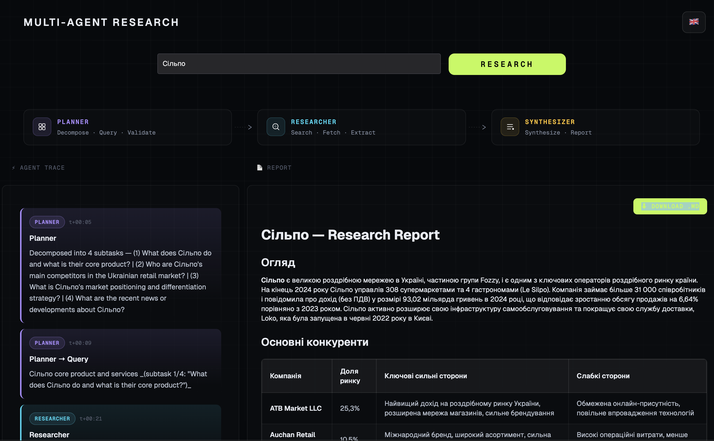
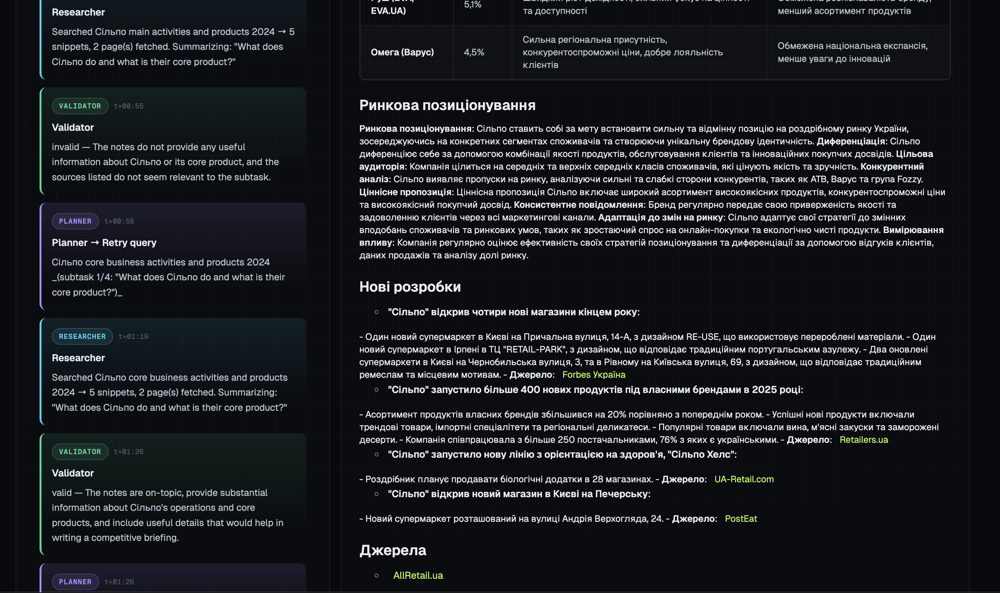

# Multi-Agent Competitive Research Tool

A **learning-first** multi-agent system that produces a competitive intelligence briefing for any company. Built with LangGraph + OpenRouter (free tier) + Gradio.

## 📸 Demo


*Streaming agent trace and final report side-by-side.*


*Detailed pipeline and progress tracking.*

## 🧠 Architecture & The Planner's Brain

The system follows a **Plan-Execute-Reflexion** pattern. The **Planner** is the orchestrator that ensures quality by supervising the Research process.

### Detailed Workflow

```text
User Input: "Acme Corp"
    │
    ▼
[ 1. Planner: Decompose ]
    │  LLM breaks the request into 3-4 distinct research questions (subtasks).
    │
    ▼
    Loop for each Subtask:
    │
    ├──► [ 2. Planner: Query Generator ]
    │         │  LLM creates a surgical search query (e.g. "Acme Corp pricing 2024").
    │         │
    │         ▼
    │    [ 3. Researcher Agent ]
    │         │  Web search → HTML extraction → LLM Summarization of findings.
    │         │
    │         ▼
    │    [ 4. Planner: Validator ]  ◄── (Reflexion Step)
    │         │  LLM checks: "Do these notes actually answer the question?"
    │         │
    │         └─── (Invalid) ──► [ Retry Query ] (Max 2x)
    │         │                  Attempts to fix results by changing the query angle.
    │         │
    │         └─── (Valid) ───┐
    │                         │
    ▼                         ▼
[ 5. Synthesizer Agent ] ◄────┘
       Aggregates all validated notes into a final, structured Markdown report.
```

## 🛠️ Tech Stack

| Tool | Purpose | Cost |
|------|---------|------|
| [LangGraph](https://github.com/langchain-ai/langgraph) | Multi-agent orchestration | Free |
| [OpenRouter](https://openrouter.ai) | LLM API (`qwen/qwen-2.5-72b-instruct`) | Free |
| [DuckDuckGo Search](https://pypi.org/project/duckduckgo-search/) | Web search, no API key | Free |
| [trafilatura](https://trafilatura.readthedocs.io) | Clean article extraction | Free |
| [Gradio](https://gradio.app) | Web UI + streaming | Free |
| [Render](https://render.com) | Hosting / Deployment | Free tier |

## 🚀 Local Setup

```bash
# 1. Clone and enter directory
git clone <repo-url>
cd multi-agent-system

# 2. Create virtual environment
python3.11 -m venv .venv
source .venv/bin/activate   # Windows: .venv\Scripts\activate

# 3. Install dependencies
pip install -r requirements.txt

# 4. Configure API key
cp .env.example .env
# Edit .env and paste your OPENROUTER_API_KEY

# 5. Run
python app_final.py
# Open http://127.0.0.1:7860
```

## 💡 What You'll Learn

See [LEARNING_NOTES.md](LEARNING_NOTES.md) for a concept-by-concept walkthrough explaining *why* each design choice was made, specifically:
- **State Management**: How to pass data between agents.
- **Conditional Routing**: How the Planner decides to retry a search.
- **UI Streaming**: How to show the LLM's internal thoughts to the user.

## 🌍 Deployment (Render)

1. Create a **Web Service** on Render.com.
2. Connect your GitHub repository.
3. Set **Build Command**: `pip install -r requirements.txt`.
4. Set **Start Command**: `python app_final.py`.
5. Add `OPENROUTER_API_KEY` in **Environment Variables**.
